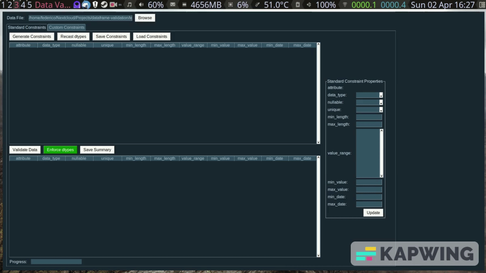

<!-- [START BADGES] -->
[](https://github.com/fedecarles/dataframe-validation/actions/workflows/pylint.yml)
[](https://github.com/fedecarles/dataframe-validation/actions/workflows/tests.yml)
<!-- [END BADGES] -->

# DataFrame-Validation

1. [What it Does](#what-it-does)
1. [Installation](#installation)
2. [Generating Constraints](#generating-constraints)
3. [Validating Data](#validating-data)
4. [GUI](#dv-py-gui)

## What it does
db-py is a tool to validate pandas DataFrames based on pre-defined set of constraints. 

The standard constraints include:

* **Null check**: Checks for null values in a DataFrame column.
* **Unique check**: Checks if a column has duplicate values.
* **Max Length**: Checks if a string value in a column exceeds the maximum number of characters.
* **Min Length**: Checks if a string value in a column exceeds the minimum number of characters.
* **Value Range**: Checks if a column has values outside the expected list of values.
* **Max Value**: Checks if a value in a column exceed the expected max value.
* **Min Value**: Checks if a value in a column exceed the expected min value.
* **Custom Constraint**: User defined checks using the pandas query engine.

The main use case for dv-py is where a dataset with the same shape and attributes needs to be
validated on a recurring basis.

## Installation

This program has some dependencies, mainly pandas and numpy. PySimpleGUI is required
for running the gui version. It's recommended to install these in a virtual environtment.

```
pip install -r requirements.txt

```

## Generating constraints

A set of constraints can be generated by creating a **StandardConstraints** object and running the **generate_constraints** method.

```python
from constraints import StandardConstraints
import pandas as pd

df1 = pd.read_csv("brain_dataset_old.csv")

std_const = StandardConstraints() # create the standard constraints object
std_const.generate_constraints(df1) # generate constraints for the dataframe
print(constraints)
```
dv-py will attempt to determine the constraints for each column in the dataframe.
```
gender: {'data_type': 'category', 'nullable': False, 'min_length': 4, 'max_length': 6, 'value_range': {'Female', 'Male'}}
age: {'data_type': 'float64', 'nullable': False, 'min_value': 0.08, 'max_value': 82.0}
hypertension: {'data_type': 'int64', 'nullable': False, 'min_value': 0, 'max_value': 1}
heart_disease: {'data_type': 'int64', 'nullable': False, 'min_value': 0, 'max_value': 1}
ever_married: {'data_type': 'category', 'nullable': False, 'min_length': 2, 'max_length': 3, 'value_range': {'No', 'Yes'}}
work_type: {'data_type': 'category', 'nullable': True, 'min_length': 7, 'max_length': 13.0, 'value_range': {nan, 'Private', 'children', 'Self-employed', 'Govt_job'}}
Residence_type: {'data_type': 'category', 'nullable': False, 'min_length': 5, 'max_length': 5, 'value_range': {'Rural', 'Urban'}}
avg_glucose_level: {'data_type': 'float64', 'nullable': False, 'min_value': 55.12, 'max_value': 271.74}
bmi: {'data_type': 'float64', 'nullable': False, 'min_value': 14.0, 'max_value': 48.9}
smoking_status: {'data_type': 'category', 'nullable': False, 'min_length': 6, 'max_length': 15, 'value_range': {'Unknown', 'smokes', 'formerly smoked', 'never smoked'}}
stroke: {'data_type': 'bool', 'nullable': False}
date: {'data_type': 'category', 'nullable': False, 'min_length': 10, 'max_length': 10, 'value_range': {'2022/06/30', '2021/12/31', '2022/03/31'}}
```

The individuals constraints can be modified as needed with the **modify_constraint** method.

```python
constraints.modify_constraint("gender", {"data_type": "category"}) 
constraints.modify_constraint("work_type", {"data_type": "category", "nullable": False}) 
constraints.modify_constraint("age", {"max_value": 80, "data_type": "int64"}) 
constraints.modify_constraint("date", {"data_type": "datetime64[ns]"}) 
```

The constraints can then be saved as json or csv.
```python
constraints.modify_constraint("work_type", {"nullable": False})
```

## Validating data

A set of constraints can be used to validate a different dataset version with the StandardVerifier class.

```python
from verifiers import StandardVerifier
df2 = pd.read_csv(r"test_data/brain_stroke.csv") # load new data into pandas

constraints = StandardConstraints().read_constraints("example_constraints.json")
verify = StandardVerifier(df2, constraints) # verify data against constraints
print(verify.validation_summary) # print validation summary
```
The **enforce_dtypes** option will read the new dataframe with the data types from the 
constraints.

The validation summary displays the break count for each constraint and attribute, where applicable.

```
            gender    age hypertension heart_disease ever_married work_type Residence_type avg_glucose_level    bmi smoking_status stroke   date
data_type    False  False        False         False        False     False          False             False  False          False  False  False
nullable         0      0            0             0            0         5              0                 0      0              0      0      0
min_length       0    NaN          NaN           NaN            0         0              0               NaN    NaN              0    NaN      0
max_length       0    NaN          NaN           NaN            0         0              0               NaN    NaN              0    NaN      0
value_range      0    NaN          NaN           NaN            0         0              0               NaN    NaN              0    NaN      0
min_value      NaN      0            0             0          NaN       NaN            NaN                 0      0            NaN    NaN    NaN
max_value      NaN    116            0             0          NaN       NaN            NaN                 0      0            NaN    NaN    NaN
```

A detail report with the rows with the specific records that failed the validation can be generated.

```python
print(verify.validation_data)
```

```

    gender   age  hypertension  heart_disease ever_married      work_type Residence_type  avg_glucose_level   bmi   smoking_status  stroke       date           Validation
4     Male  81.0             0              0          Yes            NaN          Urban             186.21  29.0  formerly smoked    True 2021-12-31       max_value: age
8   Female  81.0             1              0          Yes            NaN          Rural              80.43  29.7     never smoked    True 2021-12-31       max_value: age
19    Male  82.0             0              1          Yes        Private          Rural             208.30  32.5          Unknown    True 2021-12-31       max_value: age
26  Female  82.0             1              0          Yes  Self-employed          Urban             196.92  22.2     never smoked    True 2021-12-31       max_value: age
29  Female  82.0             1              1           No        Private          Rural              84.03  26.5  formerly smoked    True 2021-12-31       max_value: age
..     ...   ...           ...            ...          ...            ...            ...                ...   ...              ...     ...        ...                  ...
4     Male  81.0             0              0          Yes            NaN          Urban             186.21  29.0  formerly smoked    True 2021-12-31  nullable: work_type
5     Male  74.0             1              1          Yes            NaN          Rural              70.09  27.4     never smoked    True 2021-12-31  nullable: work_type
6   Female  69.0             0              0           No            NaN          Urban              94.39  22.8     never smoked    True 2021-12-31  nullable: work_type
7   Female  78.0             0              0          Yes            NaN          Urban              58.57  24.2          Unknown    True 2021-12-31  nullable: work_type
8   Female  81.0             1              0          Yes            NaN          Rural              80.43  29.7     never smoked    True 2021-12-31  nullable: work_type

[121 rows x 13 columns]
```

## dv-py GUI

A gui version is available with the basic functionality, currently it only supports csv and excel files.
```python
python -m gui
```


